# Tutorial Nginx Servers
## Estructura de directorios

- creamos los directorios, 1 por cada nginx que queramos lanzar y el directorio `Proxy` que contendrá la configuracion principal `nginx.conf` y los certificados `SSL`

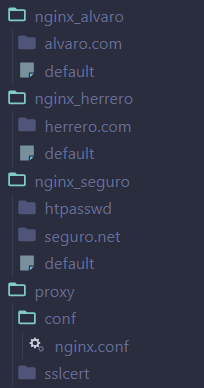

- creamos el `docker-compose.yml`


## Configuración Nginx Server

- Lo primero que tenemos que hacer es crear un nuevo archivo en el directorio `nginx-tuSite` con el nombre `default` para sobreescribir la configuraion por defecto y no tener que configurar sitos disponibles.

una vez dentro del archivo, debemos agregar la siguiente información:

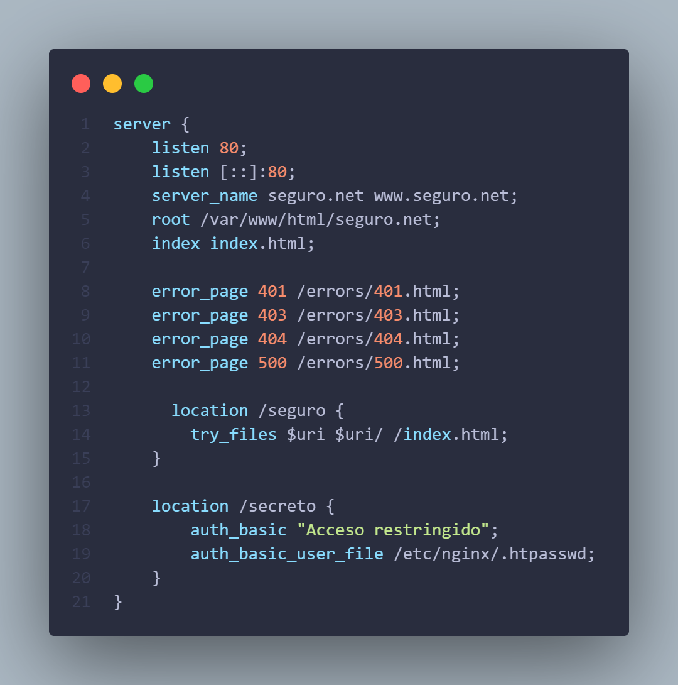

- Lo unico que cambia frente a configuraciones anteriores es que cuando entre en /secreto le serviremos el index.html y quitamos toda la configuracion de ssl ya que esta irá en el `Proxy inverso`


   
## Generar certificado SSL y contraseña con OpenSSL

- Primero debemos instalar OpenSSL en nuestra maquina.


- Ahora crearemos el certificado y la key con OpenSSL.

```bash
openssl req -x509 -nodes -days 365 -newkey rsa:2048 -keyout seguro.net.key -out seguro.net.crt
```
 pegaremos este comando en la **`Terminal propia de OpenSSL`** esto nos pedira que introduzcamos la información necesaria para crear el certificado y la key.

 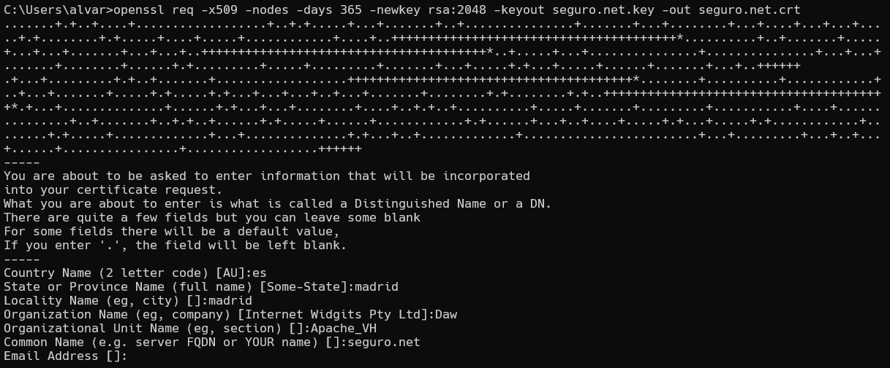

 tendremos en cuenta que en el Campo "Common Name" introducimos el nombre de nuestro dominio. En este caso es `seguro.net`.

 los 2 archivos que hemos generado son `seguro.net.key` y `seguro.net.crt` y los pegaremos en el directorio `sslcert` para que los pueda usar Apache.

 - Para generar la contraseña, utilizaremos el siguiente comando:
 
 ```bash
 openssl passwd
 ```

 esto nos pedira que introduzcamos una contraseña y nos generara un odigo que hace referencia a nuestra contraseña.

 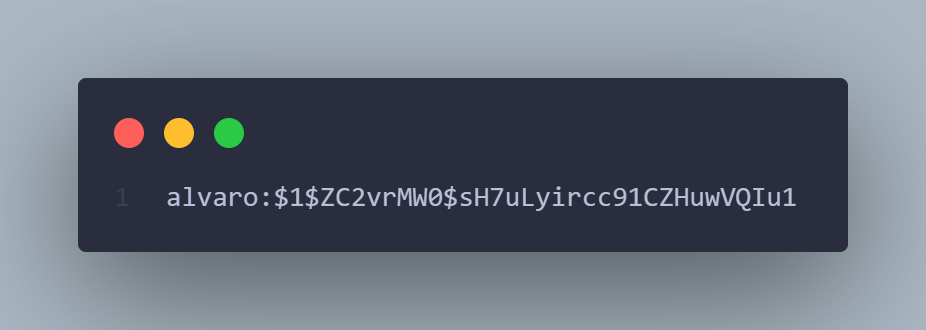

 dentro del archivo `htpasswd` escribiremos  `nombre del usuario : código generado por OpenSSL.`

## Nginx Reverse Proxy Conf

- Primero redirijimos todas las peticiones del puerto 80 al 443

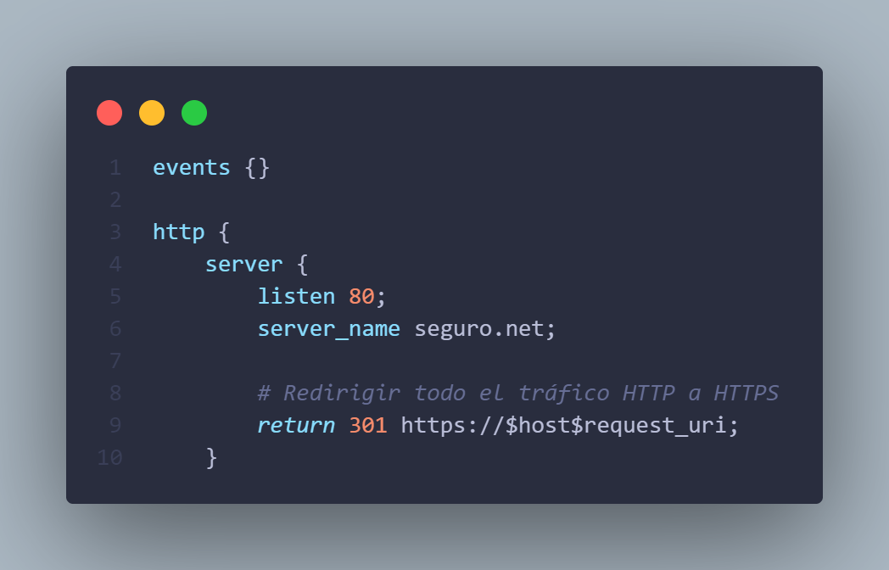

- Seguiremos con la configuracion normal de un server incluyendo el `SSL`

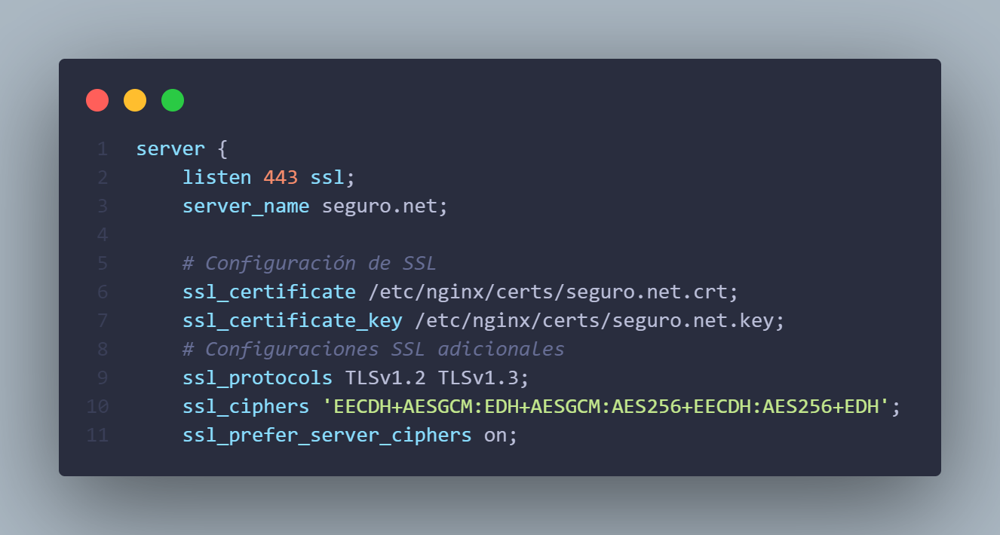

- Por Ultimo configuraremos cada endpoint de la url para que nos redireccione a cada sito que en este caso estan todos hechos en nginx pero podrian ser apache

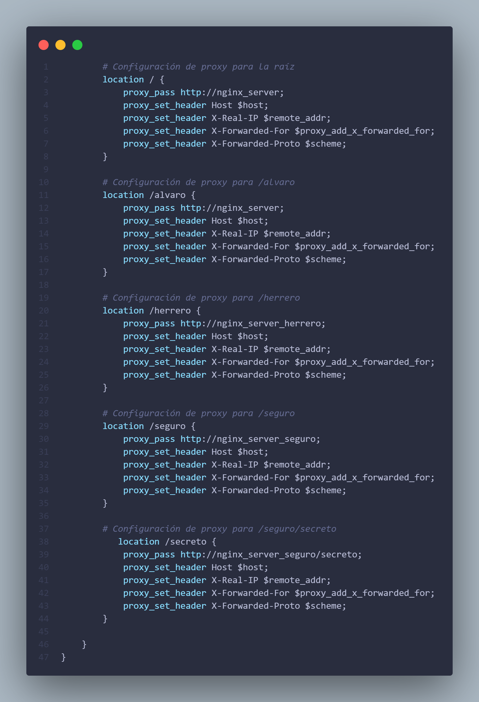

## Docker Compose

```yml
services:

  nginx_alvaro:
    image: ubuntu/nginx
    container_name: nginx_server
    volumes:
      - ./nginx_alvaro/default:/etc/nginx/sites-available/default
      - ./nginx_alvaro/alvaro.com:/var/www/html/alvaro.com
    restart: always
    networks:
      - webnet

  nginx_herrero:
    image: ubuntu/nginx
    container_name: nginx_server_herrero
    volumes:
      - ./nginx_herrero/default:/etc/nginx/sites-available/default
      - ./nginx_herrero/herrero.com:/var/www/html/herrero.com
    restart: always
    networks:
      - webnet

  nginx_seguro:
    image: ubuntu/nginx
    container_name: nginx_server_seguro
    volumes:
      - ./nginx_seguro/default:/etc/nginx/sites-available/default
      - ./nginx_seguro/seguro.net:/var/www/html/seguro.net
      - ./nginx_seguro/htpasswd/.htpasswd:/etc/nginx/.htpasswd
    restart: always
    networks:
      - webnet

  proxy:
    image: ubuntu/nginx
    container_name: proxy_server
    ports:
      - "80:80"
      - "443:443"
    volumes:
      - ./proxy/conf/nginx.conf:/etc/nginx/nginx.conf
      - ./proxy/sslcert:/etc/nginx/certs
    restart: always
    depends_on:
      - nginx_alvaro
      - nginx_herrero
      - nginx_seguro
    networks:
      - webnet

networks:
  webnet:
```

- Este es el `docker-compose.yml` que nos permite crear y administrar nuestros servidores nginx y su `Proxy inverso`
  - crearemos un contenedor por cada servidor nginx 
  - crearemos un contenedor para el `Proxy inverso` que dependera de los otros contenedores
  - crearemos una red por la cual se conectaran los contenedores
    - **Solo abriremos los puertos del proxy ya que nadie se conecta directamente a los servidores nginx**

- Para levantar y tirar el docker compose, utilizamos los siguientes comandos:

```bash	
docker-compose up -d
docker-compose down
```

## Hosts File

>[!WARNING]
>Este archivos es delicado y se debe editar con cuidado ademas de hacer un backup del archivo original.

- Para que Nginx pueda acceder al `Proxy inverso`, debemos agregar el nombre del dominio al archivo `C:\Windows\System32\drivers\etc\hosts`.

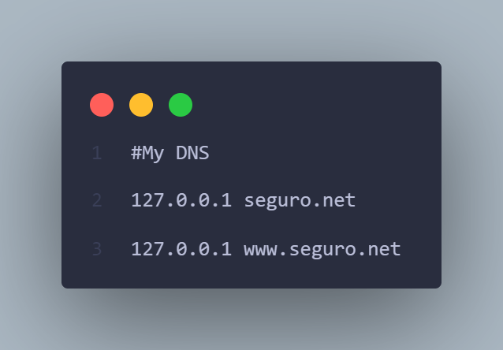

## Ejemplos de funcionamiento de la web

### Alvaro.com

- https://seguro.net
- https://seguro.net/alvaro

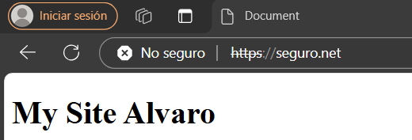


### Herrero.com

- https://seguro.net/herrero

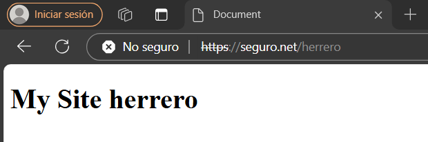

### Seguro.net

- https://seguro.net/seguro

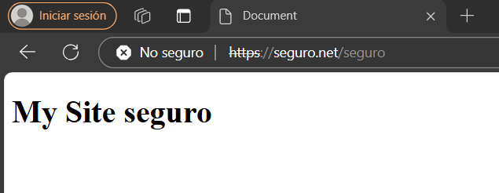

- https://seguro.net/secreto

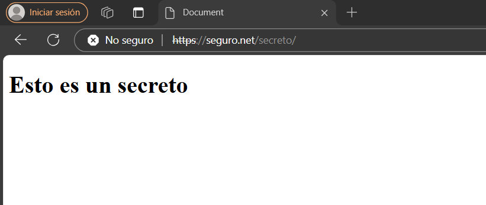

# Autor

Realizado por [Álvaro Herrero Tamayo](https://github.com/alvarito304)